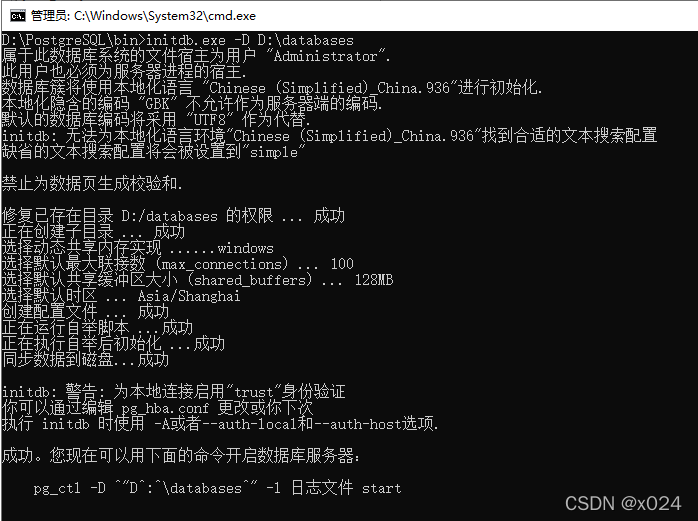

# 安装

PostgreSQL 提供了多个平台的安装包，整体安装步骤也非常简单。

## 1. Windows 安装

访问 [PostgreSQL 官网](https://www.postgresql.org)下载对应版本的 [Windows 安装包](https://www.postgresql.org/download/windows)，下载完成后直接运行安装包进行安装，注意过程中安装路径的更改。


### 1.1 初始化失败

如果在安装快结束时，出现弹窗 “Problem running post-install step. Installation may not complete correctly. The database cluster initialiation failed.” 则表示初始化失败。

**解决办法**：在终端中进入 PostgreSQL 安装目录下 `bin` 文件夹下，并执行如下命令：

```powershell
initdb.exe -D "D:\PostgreSQL\17\databases"
```



这里提示我们使用如下命令来启动 PostgreSQL 数据库服务：

```powershell
pg_ctl.exe -D "D:\\PostgreSQL\\17\\databases" -l logfile start
```

### 1.2 创建 PostgreSQL 服务

完成上面操作后，为了更方便地启动 PostgreSQL 服务，我们最好在 Windows 系统中创建一个 PostgreSQL 服务，方便后续使用。

```powershell
pg_ctl.exe register -N PG17 -D "D:\\PostgreSQL\\17\\databases"
```

### 1.3 创建数据库和用户

执行 `createdb.exe` 进行 PostgreSQL 命令行终端，使用如下命令创建数据库和用户，并进行赋权：

```powershell
CREATE USER dbt WITH PASSWORD 'dbt';
CREATE DATABASE dbt;
GRANT ALL PRIVILEGES ON DATABASE dbt TO dbt;
```

接下来就可以使用 pgAdmin 软件进行登录了。


## 2. MacOS 安装


## 3. Linux 安装

